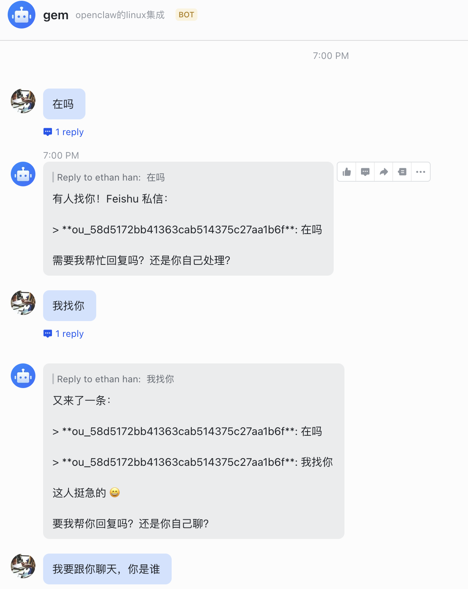
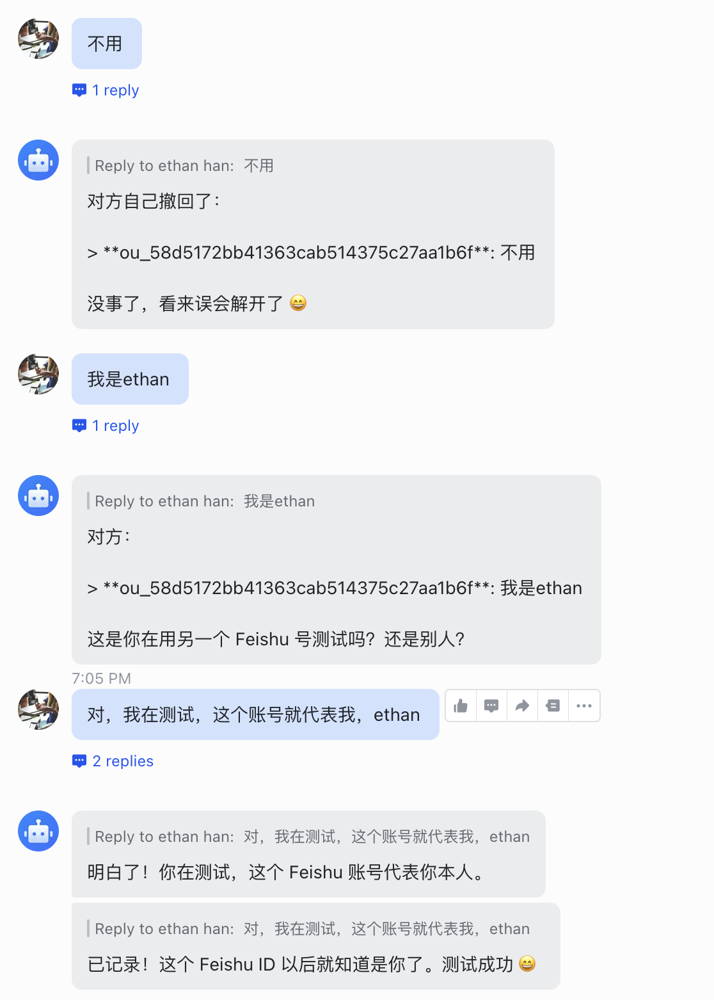

之前在 Linux 机器上装了 OpenClaw，每次访问 Dashboard 都得用 SSH 端口转发，用起来不太方便。

更合理的方式是把飞书和 OpenClaw 做集成，直接在飞书里就能聊天交互，这样更自然一点。

## 使用到的plugin

这里用到了[clawdbot-feishu](https://github.com/m1heng/Clawdbot-feishu?tab=readme-ov-file#%E4%B8%AD%E6%96%87)插件，直接在命令行里安装。

## 安装clawdbot-feishu插件

```
openclaw plugins install @m1heng-clawd/feishu
```

## 创建飞书应用

然后在 在 [飞书开放平台](https://open.feishu.cn) 创建自建应用。

应用名称和描述都不重要。

然后添加应用能力，加个机器人。

接下来在权限管理里面增加下面的权限。

| 权限                               | 范围     | 说明                                                                        |
| ---------------------------------- | -------- | --------------------------------------------------------------------------- |
| `contact:user.base:readonly`       | 用户信息 | 获取用户基本信息（用于解析发送者姓名，避免群聊/私聊把不同人当成同一说话者） |
| `im:message`                       | 消息     | 发送和接收消息                                                              |
| `im:message.p2p_msg:readonly`      | 私聊     | 读取发给机器人的私聊消息                                                    |
| `im:message.group_at_msg:readonly` | 群聊     | 接收群内 @机器人 的消息                                                     |
| `im:message:send_as_bot`           | 发送     | 以机器人身份发送消息                                                        |
| `im:resource`                      | 媒体     | 上传和下载图片/文件                                                         |

## 在 openclaw 中增加channel

回到命令行，用下面的命令添加channel。

```
openclaw channels add
```

选择飞书，各种下一步，然后去飞书的开发者后台把App ID 和 App Secret拿到，贴到命令行里。

然后就各种下一步。

## 设置事件与回调

接下来设置事件与回调，这一步非常重要。


1. **事件配置方式**：选择 **使用长连接接收事件**（推荐）
2. **添加事件订阅**，勾选以下事件：

| 事件                            | 说明             |
| ------------------------------- | ---------------- |
| `im.message.receive_v1`         | 接收消息（必需） |
| `im.message.message_read_v1`    | 消息已读回执     |
| `im.chat.member.bot.added_v1`   | 机器人进群       |
| `im.chat.member.bot.deleted_v1` | 机器人被移出群   |

## 发布并审核。

然后在飞书开发者后台的版本管理与发布页面，创建一个版本，并提交。

**下面这一步也非常重要，第一次配置的时候我就没弄明白。去飞书的管理后台里面，把应用审核，正式发布一下。**

## 测试一下

发布成功之后，在飞书会发一条审核通过的消息，在消息里打开应用，就可以跟机器人聊天了。



我的机器人比较笨，跟它说了半天才弄明白了我是谁。



不过能聊天就代表配置成功了。
