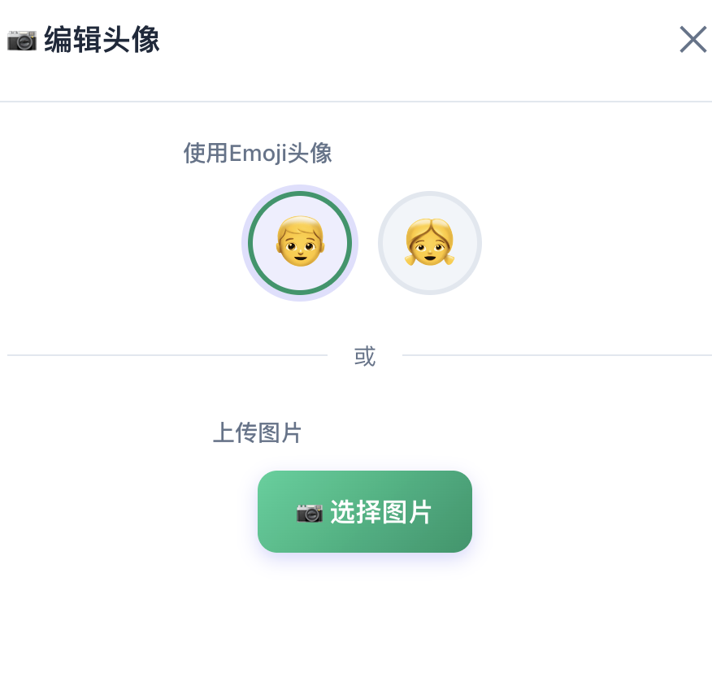
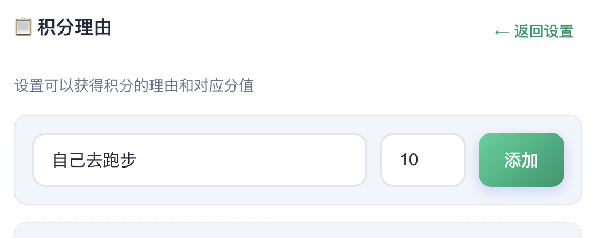
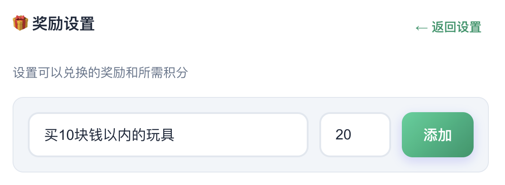
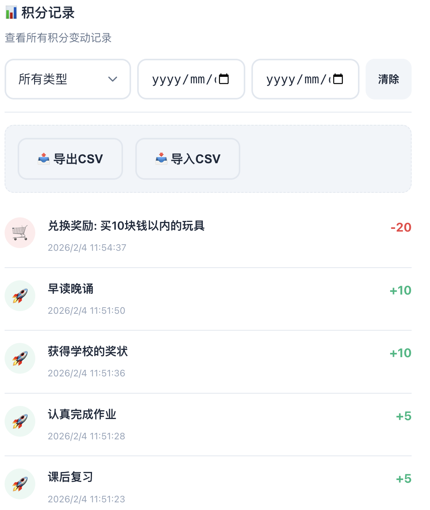

事情是这样的，为了提升家里小学生的自主学习意识，所以我想做一个简单的小学生积分系统。

如果小朋友的行为值得鼓励，那么就给他奖励一些积分。积分可以用来兑换奖励，但是如果小朋友的行为是需要纠正的，那么就给他扣掉一些积分。

正好最近opencode很火，所以就用AI来帮我们实现一下吧。

## 功能演示

我这个应用叫做kidcions，一个纯的react前端单页项目，没有后台没有存储，用户数据是放在localstorage里面的。

项目我部署在cloudflare的page上了，大家有兴趣可以体验一下,地址是[https://kid.ethanhan.cc/](https://kid.ethanhan.cc/)

简单介绍一下功能。

家长可以添加小朋友。

可以给小朋友换个头像。

可以增加积分。应用默认给了一些积分项。

当然，也可以自己设置积分项。

有了积分就可以兑换奖品。

奖品也是可以自己设置的。

最后所有的积分记录都可以导出。

添加多个小朋友也是支持的。

还支持暗夜模式。

移动端也适配了。

## 实现过程

实现过程其实比较的枯燥。

大致总结一下就是。

首先描述需求，描述的时候最好可以举几个例子，比如kid选择器的样式；

然后就是等待AI编码完成，因为项目非常简单，所以这一步其实不算慢；

最后就是自己上手去试用生成的应用，遇到问题就记录下来，让AI去解决。

要注意一下这里有个最小闭环原则，每次提出1个需求或者1个bug，实现了之后再去逐步推进。

## 关于模型

opencode可以直接拿来免费就用的。

因为每个免费的模型似乎都是有额度的，而单一的额度没办法支持把这个项目写完。

所以这个应用我用到了3个模型。

分别是开始的时候用到了kimi2.5，额度用完了之后换到了glm4.7，再次没有token之后换成了minimax。

所以如果想要用opencode愉快的玩耍的话，大家最好还是要买个稳定的套餐。

## 一些感想

最后来说说使用过程中的一些感想。

第一点就是整个过程有点像是先当产品经理，把想要实现的需求先列出来，然后当项目经理，给这些需求排期，先实现哪个，再实现哪个，最后当测试人员，自己试用，然后提bug，跟进缺陷的修复。

第二点就是如果你完全不会写代码的话，那么有可能有些描述就可能不会特别精确，从而需要进行多轮的对话和改进。举个例子，应用里有个区域的class是`.item-card`，在移动端下，样式出现了点问题，因为我会一点css，能看出来是`overflow`这个属性有问题问题，因此可以直接告诉ai问题的根本所在，否则的话，可能需要反复描述细节才能解决问题了吧。
